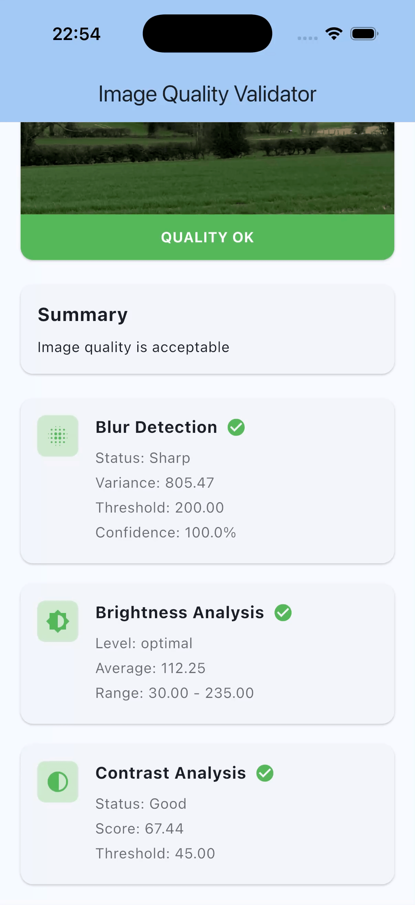

# Image Blur Detection

A pure Dart/Flutter package to detect blur, brightness, and contrast issues in images with configurable thresholds.

This package is especially useful for:
- Card scanning (ID cards, credit cards, driver's licenses)
- Document scanning
- Photo capture validation
- Any scenario where image quality needs to be validated before processing

## Demo



[Watch the example video](assets/Simulator%20Screen%20Recording%20-%20iPhone%2017%20Pro%20-%202026-01-14%20at%2023.21.37.mp4)

## Features

- **Blur Detection**: Uses Laplacian variance algorithm to detect blurry images
- **Brightness Analysis**: Detects underexposed (too dark) or overexposed (too bright) images
- **Contrast Analysis**: Detects low contrast images using histogram-based standard deviation
- **Configurable Thresholds**: Easily adjust sensitivity for your use case
- **Preset Configurations**: Ready-to-use presets for common scenarios
- **Pure Dart**: No native dependencies, works on all platforms

## Installation

Add this to your `pubspec.yaml`:

```yaml
dependencies:
  image_blur_detection: ^1.0.0
```

Then run:

```bash
dart pub get
```

## Quick Start

```dart
import 'package:image_blur_detection/image_blur_detection.dart';

// Simple usage with defaults
final validator = ImageQualityValidator();
final result = await validator.validate(imageBytes);

if (result.isValid) {
  // Proceed with image processing
} else {
  print('Issues: ${result.issues}');
}
```

## Usage

### Basic Validation

```dart
import 'dart:io';
import 'package:image_blur_detection/image_blur_detection.dart';

// Read image from file
final file = File('path/to/image.jpg');
final imageBytes = await file.readAsBytes();

// Validate the image
final validator = ImageQualityValidator();
final result = await validator.validate(imageBytes);

if (result.isValid) {
  print('Image quality is good!');
} else {
  print('Issues found: ${result.issues}');
  print('Primary issue: ${result.errorMessage}');
}
```

### Using Preset Configurations

The package includes preset configurations optimized for common use cases:

```dart
// Card scanning (relaxed thresholds for handheld scanning)
final cardValidator = ImageQualityValidator(
  config: QualityConfig.cardScanning,
);

// Document scanning (moderate thresholds)
final docValidator = ImageQualityValidator(
  config: QualityConfig.documentScanning,
);

// Photo capture (stricter blur detection)
final photoValidator = ImageQualityValidator(
  config: QualityConfig.photoCapture,
);

// Relaxed (for challenging conditions)
final relaxedValidator = ImageQualityValidator(
  config: QualityConfig.relaxed,
);

// Strict (for high quality requirements)
final strictValidator = ImageQualityValidator(
  config: QualityConfig.strict,
);
```

### Custom Configuration

```dart
final customValidator = ImageQualityValidator(
  config: QualityConfig(
    blurThreshold: 150.0,    // Higher = stricter blur detection
    minBrightness: 50.0,     // 0-255 scale
    maxBrightness: 200.0,    // 0-255 scale
    minContrast: 60.0,       // Higher = require more contrast
  ),
);

// Or modify an existing config
final modifiedConfig = QualityConfig.cardScanning.copyWith(
  blurThreshold: 100.0,  // Override just the blur threshold
);
```

### Individual Quality Checks

You can also perform individual checks if you only need specific validation:

```dart
final validator = ImageQualityValidator();

// Check only blur
final blurResult = validator.checkBlur(imageBytes);
print('Is blurry: ${blurResult.isBlurry}');
print('Variance: ${blurResult.variance}');

// Check only brightness
final brightnessResult = validator.checkBrightness(imageBytes);
print('Level: ${brightnessResult.level}');
print('Average: ${brightnessResult.averageBrightness}');

// Check only contrast
final contrastResult = validator.checkContrast(imageBytes);
print('Has good contrast: ${contrastResult.hasGoodContrast}');
print('Score: ${contrastResult.contrastScore}');
```

### Using Detectors Directly

For more control, you can use the individual detectors directly:

```dart
// Blur detection
const blurDetector = BlurDetector(threshold: 120.0);
final blurResult = blurDetector.detect(imageBytes);

// Brightness analysis
const brightnessAnalyzer = BrightnessAnalyzer(
  minBrightness: 45.0,
  maxBrightness: 210.0,
);
final brightnessResult = brightnessAnalyzer.analyze(imageBytes);

// Contrast analysis
const contrastAnalyzer = ContrastAnalyzer(minContrast: 55.0);
final contrastResult = contrastAnalyzer.analyze(imageBytes);
```

### Working with Pre-decoded Images

If you already have a decoded image (using the `image` package), you can use the `FromImage` methods to avoid re-decoding:

```dart
import 'package:image/image.dart' as img;

final image = img.decodeImage(imageBytes);

final validator = ImageQualityValidator();
final result = await validator.validateFromImage(image);

// Or with individual detectors
final blurResult = blurDetector.detectFromImage(image);
final brightnessResult = brightnessAnalyzer.analyzeFromImage(image);
final contrastResult = contrastAnalyzer.analyzeFromImage(image);
```

## Threshold Guidelines

### Blur Threshold (Laplacian Variance)

The blur threshold represents the minimum Laplacian variance for a sharp image. Higher values require sharper images.

| Use Case | Recommended Range | Description |
|----------|------------------|-------------|
| Relaxed | 50-80 | For low-quality cameras or challenging conditions |
| Card Scanning | 80-150 | Standard handheld card scanning |
| Document Scanning | 100-200 | Text documents where sharpness matters |
| Photo Capture | 150-300 | When high quality photos are required |
| Strict | 250-500 | Professional quality requirements |

### Brightness (0-255 Scale)

| Setting | Too Dark | Too Bright | Description |
|---------|----------|------------|-------------|
| Relaxed | < 25 | > 240 | Very permissive |
| Standard | < 40 | > 220 | General purpose |
| Strict | < 50 | > 200 | Well-lit environments |

### Contrast (Standard Deviation)

The contrast score is the standard deviation of pixel luminance values. Higher values indicate more contrast.

| Use Case | Minimum Score | Description |
|----------|--------------|-------------|
| Relaxed | 30-40 | Accept low contrast images |
| Standard | 50-60 | General purpose |
| Strict | 65+ | Require good contrast |

## API Reference

### Classes

#### `ImageQualityValidator`
Main validator that combines all quality checks.

#### `BlurDetector`
Detects blur using Laplacian variance method.

#### `BrightnessAnalyzer`
Analyzes image brightness/exposure.

#### `ContrastAnalyzer`
Analyzes image contrast.

#### `QualityConfig`
Configuration for all quality thresholds.

### Result Classes

#### `QualityResult`
Combined result with `isValid`, `issues`, `errorMessage`, and individual results.

#### `BlurResult`
Contains `isBlurry`, `variance`, `confidence`, and `threshold`.

#### `BrightnessResult`
Contains `level` (tooDark/optimal/tooBright), `averageBrightness`, and thresholds.

#### `ContrastResult`
Contains `hasGoodContrast`, `contrastScore`, and `threshold`.

## How It Works

### Blur Detection (Laplacian Variance)

1. Convert image to grayscale
2. Apply Laplacian filter (edge detection)
3. Calculate variance of the result
4. Sharp images have high variance (many strong edges)
5. Blurry images have low variance (edges are smoothed)

### Brightness Analysis

1. Calculate the luminance of each pixel
2. Compute the average luminance
3. Compare against min/max thresholds

### Contrast Analysis

1. Calculate the luminance of each pixel
2. Compute the standard deviation of luminance values
3. Higher standard deviation = more contrast

## Example

See the [example](example/example.dart) for a complete demonstration of all features.

## Contributing

Contributions are welcome! Please feel free to submit a Pull Request.

## License

This project is licensed under the MIT License - see the [LICENSE](LICENSE) file for details.
